# Building a small programming language with ANTLR

Creating a programming language does not necessarily mean writing a virtual machine or compiling to machine code. A domain-specific language can stop at a much smaller, and still useful boundary: parse source text, give it domain meaning, and turn it into application data.

CronoScript demonstrates this approach with a language for describing project timelines. A text document becomes a visual timeline:

```CronoScript
#dateFormat:dd/MM/yyyy

"Website launch" [
    ['01/04/2024'] "Kick-off",
    ['02/04/2024' -> '12/04/2024'] "Implementation",
    [
        ['15/04/2024' -> '17/04/2024'] "Internal testing",
        ['18/04/2024'] "Release"
    ] "Delivery"
]
```

The implementation contains the core of a language front end: a lexer and parser generated by [ANTLR](https://www.antlr.org/), a TypeScript visitor that interprets the parse tree, an intermediate representation of the planning, and a browser application that renders the result.

This tutorial follows that pipeline from source text to tokens, structure, domain meaning, and application data.

## Define the domain model first

CronoScript starts with two primitives:

- a date is a point in time;
- a group contains dates or other groups.

The rest of the language emerges from their composition. A group containing one date is an event. A group containing two linked dates is a task. A larger group becomes a timeline or a bracket around several related items.

```CronoScript
['09/09/2024'] "Birthday"

['01/04/2024' -> '05/04/2024'] "Write documentation"

"Release" [
    ['01/04/2024' -> '05/04/2024'] "Write documentation",
    ['08/04/2024' -> '10/04/2024'] "Publish"
]
```

This is a small example of language design rather than just parsing. The syntax has to make common documents readable, remain unambiguous to a parser, and map cleanly to the concepts used by the application.

The syntax uses quoted dates, double-quoted labels, square brackets for grouping, and separators with domain meaning:

| Syntax | Meaning |
| --- | --- |
| `,` | Two independent elements |
| `->` | Link the left element to the right one |
| `->+` | Link to a date computed from a duration |
| `...` | Delay one element until another |
| `...+` / `...-` | Compute a delayed date from a duration |

Durations such as `2_days` are first-class values, so the language can also describe computed dates:

```CronoScript
['01/04/2024' ->+ 2_weeks] "Two-week task"
```

The grammar also accounts for typed or inferred variables, tags, arithmetic expressions, and configurable date formats. These features expose the important difference between recognizing syntax and executing its meaning.

## The language-processing pipeline

ANTLR is a parser generator. Instead of hand-writing all the code that reads source characters, the language is described in a grammar file from which ANTLR generates a lexer and parser.

The complete application needs several distinct stages:

```mermaid
flowchart LR
    SOURCE["CronoScript source"] --> LEXER["ANTLR lexer"]
    LEXER --> TOKENS["Token stream"]
    TOKENS --> PARSER["ANTLR parser"]
    PARSER --> TREE["Parse tree"]
    TREE --> VISITOR["Custom TypeScript visitor"]
    VISITOR --> MODEL["Flat planning model"]
    MODEL --> INTERPRET["Events, tasks and brackets"]
    INTERPRET --> CANVAS["Canvas renderer"]
```



These stages answer different questions:

1. The lexer asks: which character sequences are dates, strings, identifiers, operators, or whitespace?
2. The parser asks: do those tokens form a valid group, expression, or document?
3. The visitor asks: what does that valid structure mean for Cronodile?
4. The application asks: which objects should be drawn, and where?

These responsibilities need clear boundaries. ANTLR can recognize the language, but application-specific semantics still belong in a separate layer.

## Describing the vocabulary with lexer rules

An ANTLR grammar contains uppercase lexer rules and lowercase parser rules. The lexer rules define the vocabulary:

```antlr
COMMA:      ',';
TO:         '->';
TOPLUS:     '->+';
DELAY:      '...';
DELAYPLUS:  '...+' | '... +' | '..+';
DELAYMINUS: '...-' | '... -' | '..-';

PLUS:       '+';
MINUS:      '-';
STAR:       '*';
SLASH:      '/';
EQUALS:     '=';

DATE:       '\'' (~('\\'|'\n'|'\r'|'\t'|'\''))+ '\'';
STRING:     '"'  (~('\\'|'\n'|'\r'|'"'))* '"';
DURATION:   INT '_' ID;
TAG:        ('#' | '@') (~(' '|'\n'|'\r'|'\t'|','|'#'|'@'))+;
ID:         [a-zA-Z_][a-zA-Z_0-9]*;
INT:        [0-9]+;

COMMENT:    ('//' ~[\r\n]* | '/*' .*? '*/') -> skip;
WS:         [ \t\r\n]+ -> skip;
```

Skipping comments and whitespace in the lexer makes formatting irrelevant to the parser. A timeline can be written on one line or indented over twenty lines without changing its structure.

Date validation belongs outside the lexer. The `DATE` token recognizes any non-empty text between single quotes; later, the visitor passes that content to `date-fns` using the format configured by a `#dateFormat` tag. This prevents the grammar from growing a separate branch for every accepted calendar format.

That separation is subtle but important: quoting is syntax, while deciding whether `31/02/2024` represents a real date is semantics.

## Turning tokens into recursive structure

The parser rules describe how tokens can be combined. The core grammar requires only a few rules:

```antlr
cronodile: ((tag | varDec | date | group) ';'?)* EOF;

group
    : ID
    | string? groupBody tag*
    | groupBody string? tag*
    ;

groupBody: '[' (element (separator element)* separator?)? ']';

element
    : ID
    | group
    | date
    | duration
    | expression
    ;

separator: COMMA | TO | TOPLUS | DELAY | DELAYPLUS | DELAYMINUS;
```

The recursion is in `element: group`. A group can contain an element, an element can be another group, and nesting can continue to any depth accepted by the parser and runtime.

Names can appear before or after a group:

```CronoScript
"Research" ['01/04/2024', '02/04/2024']
['01/04/2024', '02/04/2024'] "Research"
```

That reads naturally, but it also illustrates a language-design trade-off: every convenience added to the surface syntax creates alternatives the parser and visitor must handle. A smaller language is easier to explain, validate, and maintain.

The entry rule ends with `EOF`. Without it, a parser can successfully recognize the beginning of a document and leave unexpected trailing input unconsumed. Requiring the end of the stream makes “the entire file is valid” different from “the first construct is valid.” The top-level rule also accepts optional semicolons, so documents can use them without requiring them.

## Generate and inspect the parser

Generate two parsers from the same grammar for different purposes.

The Java target supports ANTLR's TestRig, commonly called `grun`. A small script generates and compiles the Java sources, then opens the graphical parse-tree viewer for a test input. This creates an effective grammar-development loop: change a rule, regenerate, and inspect the exact tree produced by a representative document.

The application itself uses `antlr4ts`:

```json
{
  "scripts": {
    "makeTsParser": "cd ./src/compiler/antlr/grammar && antlr4ts -Dlanguage=TypeScript -visitor CronoScript.g4 -o ../dist/TSparser",
    "build": "pnpm run makeTsParser && next build"
  }
}
```

The `-visitor` flag generates typed context classes and a visitor interface. The generated TypeScript parser is roughly 1,500 lines, but it is disposable build output; the 85-line grammar remains the source of truth.

The runtime wiring remains small:

```ts
const inputStream = CharStreams.fromString(input);
const lexer = new CronoScriptLexer(inputStream);
const tokenStream = new CommonTokenStream(lexer);
const parser = new CronoScriptParser(tokenStream);
const tree = parser.cronodile();

const visitor = new CronoScriptVisitorImpl();
const result = visitor.visit(tree);
```

At this point, however, `tree` is still an ANTLR parse tree. It contains grammar contexts and punctuation, not the data structure the renderer wants.

## Give the parse tree domain meaning

A custom visitor extends `AbstractParseTreeVisitor`. Each method translates one grammar context into a domain value:

- `visitDate` removed the quotes and parsed a `Date`;
- `visitDuration` converted a value and unit to milliseconds;
- `visitExpression` evaluated numbers, durations, and date arithmetic;
- `visitGroupBody` visited nested elements while retaining separators;
- `visitGroup` interpreted those separators as links or delays;
- `visitCronodile` assembled the final document.

The visitor's internal union types make intermediate states explicit:

```ts
type GroupBodyChild =
    | { type: "dateAtom"; object: DateAtom }
    | { type: "duration"; object: Duration }
    | { type: "group"; object: Group; children?: GroupChild[] }
    | { type: "separator"; object: string };
```

Keeping separators in the intermediate array is essential. In the final model, `->` is not an object to draw. During interpretation, though, it connects the object on its left to the object on its right.

For this source:

```CronoScript
['01/04/2024' -> '05/04/2024']
```

the visitor effectively sees:

```text
DateAtom, TO, DateAtom
```

It then sets the first date's `linkedTo` property to the second date's ID and discards the separator. This is a small semantic-lowering pass: convenient source syntax becomes a simpler relationship in the application model.

Computed links add another step. For `date ->+ duration`, the visitor calculates a new date atom, replaces the duration in the intermediate list, and links the original date to the computed one. The parser establishes that the input has the expected shape; the visitor performs the calendar operation.

## Flattening a tree without losing its hierarchy

Source groups are recursive, but the final `Cronodile` model stores flat arrays:

```ts
interface Cronodile {
    tags?: Tag[];
    groups?: Group[];
    dateAtoms?: DateAtom[];
}

interface LinkedElement {
    id: string;
    parentId: string;
    order: number;
    delayedTo?: string;
    linkedTo?: string;
}
```

A small `HierarchicalContext` tracks the visitor's current path. Entering child 2 of child 1 of root 0 produces the ID `0.1.2`; removing the final segment produces its parent ID, `0.1`.

```ts
class HierarchicalContext {
    private path: number[] = [];

    enterGroup(index: number) {
        this.path.push(index);
    }

    leaveGroup() {
        this.path.pop();
    }

    getCurrentId() {
        return this.path.join('.');
    }

    getParentId() {
        return this.path.slice(0, -1).join('.');
    }
}
```

This gives the renderer simple lookups without throwing away the source hierarchy. It can find children by `parentId`, preserve their source order, and derive display rows from paths.

These position-derived IDs are useful for simple lookups, but they are not durable identities: inserting an earlier sibling changes the IDs of everything after it. A production editor would normally assign persistent IDs or build an explicit abstract syntax tree before lowering it into a separate planning graph.

## From generic groups back to events and tasks

The grammar does not need separate `event` and `task` constructs. It parses generic groups; a later interpretation pass classifies them by structure.

- A date without a parent, or a group containing exactly one date, becomes an event.
- A group with exactly two compatible children linked by `->` becomes a task.
- Any other group becomes a group bracket spanning the dates beneath it.

That pass also recursively calculates the first and last dates of nested brackets and converts `linkedTo` relationships into drawable links. The canvas renderer then receives straightforward arrays of events, tasks, group brackets, links, and lines.

This architecture keeps the surface language composable. It also moves complexity downstream: the “decompiler” that classifies the flat model contains more than 400 lines. An interpreter or semantic projection would describe this stage more precisely, because it does not reconstruct source code.

## Integrate the parser into a live application

The parser connects to a Next.js interface with a code editor and an HTML canvas. After one second without an edit, the browser sends the source to an API route. The server compiles it, serializes the planning model, and returns it to the client. The client restores serialized dates as JavaScript `Date` objects, runs the interpretation pass, and redraws the timeline.

This feedback loop tests more than the grammar. A grammar can look elegant in isolation while producing structures that are awkward for the application consuming them. Rendering a nested CronoScript document as tasks, milestone diamonds, brackets, and links validates the complete path from syntax to visible behavior.

The integration also raises design questions that a parser-only exercise can hide:

- Does source order matter independently of dates?
- Should a link connect groups, dates, or interpreted events?
- What happens when a duration follows a group instead of a date?
- Are month and year durations fixed millisecond values or calendar operations?
- How should an invalid date appear in an interactive editor?

Those are semantic and product decisions, not grammar decisions.

## Add semantic analysis and diagnostics

Parsing variable declarations is only the syntactic part of variable support. Resolving identifiers to declared values requires a symbol table and a semantic-analysis pass. That pass should collect declarations, detect duplicate names, check types, resolve references, and report unknown identifiers.

Diagnostics also need to cross every stage of the pipeline. A compiler result can expose line, column, and message fields, while custom lexer and parser error listeners replace ANTLR's default console output. The visitor can then add domain-specific errors such as invalid dates, incompatible operands, and unsupported separator combinations.

Expression structure deserves the same attention. The grammar supports several useful combinations—number arithmetic, duration arithmetic, and date plus or minus duration—but placing every binary operator at one grammar level gives them the same precedence:

```antlr
expression
    : operand
    | expression operator expression
    | '(' expression ')'
    ;
```

For conventional arithmetic precedence, multiplication and division should be expressed separately from addition and subtraction, with tests covering associativity and parentheses.

Duration semantics also require an explicit policy. Representing a month as 30 days and a year as 365 days is simple, but calendar-aware scheduling needs operations such as “add one calendar month,” especially around daylight-saving changes and month boundaries.

A parser project benefits from three test layers: accepted and rejected syntax, visitor output, and end-to-end rendering fixtures. Table-driven cases should cover every grammar rule, operator combination, and error path.

## Design principles for a small language

The grammar is not necessarily the largest part of a language front end. In CronoScript, the grammar is about 85 lines while the custom visitor is about 840. That ratio illustrates a general rule: recognizing syntax is only the beginning.

The most reusable principles are these:

1. Start from the smallest domain concepts. Dates and recursive groups are enough to derive events, tasks, and timelines.
2. Separate syntax from validation. The lexer recognizes quoted date text; the semantic layer decides whether it is a valid date.
3. Treat the parse tree as generated infrastructure, not as the application model.
4. Introduce an explicit intermediate representation. It gives semantic passes and renderers a stable boundary.
5. Use a parse-tree viewer early. It is much easier to correct a grammar when its actual tree is visible.
6. Make errors part of the language design. A DSL is only pleasant when invalid input produces precise, domain-specific guidance.
7. Test the seams between stages. Many failures do not live entirely in the lexer, parser, visitor, or renderer; they appear in the translation between them.

For a timeline DSL, this front-end architecture is enough to produce a useful result. It provides lexical rules, recursive parsing, expression evaluation, semantic lowering, hierarchical identity, and a renderer without requiring a virtual machine or native-code compiler.

The practical starting point is a narrow problem and the smallest notation that can express it. Follow one representative example all the way from characters to a usable result. The grammar defines what can be written; the transformations after it make the language useful.

The complete implementation is available in the [Cronodile repository](https://github.com/tomx-sh/old-cronodile-2).
