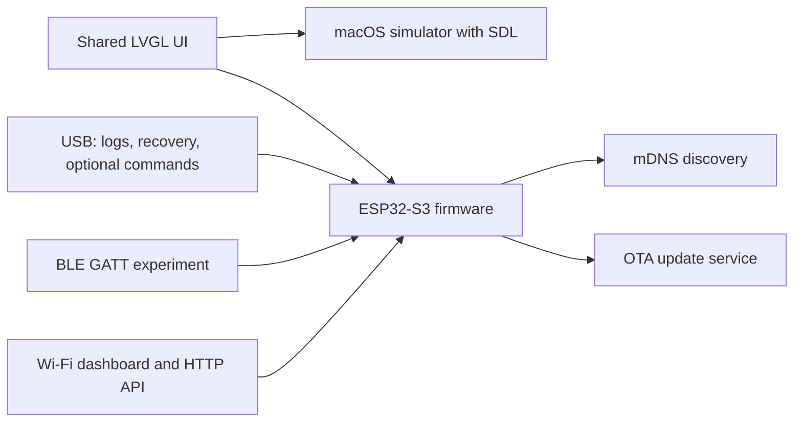

# Building a polished ESP32-S3 interface: from LVGL simulator to OTA updates

A polished embedded interface depends as much on the development loop as on the pixels on screen. If every UI change requires a flash, networking is added before memory is understood, or recovery depends on Wi-Fi, progress quickly becomes slow and unpredictable.

This guide builds that loop for the [Waveshare ESP32-S3 Touch AMOLED 1.8](https://docs.waveshare.com/ESP32-S3-Touch-AMOLED-1.8): verify the board first, keep the LVGL interface portable, bring up each control transport independently, provision Wi-Fi through a local dashboard, make `.local` discovery responsive, and use OTA only after USB recovery is proven.

The example device is a small desktop agent display. It shows animated status sprites, accepts commands from development tools, and exposes display, audio, page, and sprite controls over HTTP. The same architecture applies to control panels, sensor displays, and other connected ESP32-S3 products.



## 1. Verify the hardware before building the UI

The board contains an ESP32-S3, a 368×448 SH8601 AMOLED display over QSPI, an FT3168 capacitive touch controller, 16 MB of flash, and 8 MB of octal PSRAM. The matching PlatformIO target is important:

```ini
[env:esp32-s3-devkitc-1]
platform = https://github.com/pioarduino/platform-espressif32/releases/download/stable/platform-espressif32.zip
board = esp32-s3-devkitc1-n16r8
framework = arduino
monitor_speed = 115200

build_flags =
  -DARDUINO_USB_MODE=1
  -DARDUINO_USB_CDC_ON_BOOT=1
  -DLV_CONF_PATH=\"${PROJECT_DIR}/include/lv_conf.h\"

lib_deps =
  lvgl/lvgl@^9.5.0
  moononournation/GFX Library for Arduino@1.6.5
  h2zero/NimBLE-Arduino@^2.5.0
  bblanchon/ArduinoJson@^7.4.2
```

Do not substitute the similarly named no-PSRAM ESP32-S3 profile. A firmware built with the wrong profile can initialize the display and then fail later when LVGL, a GIF decoder, Wi-Fi, and the web server compete for internal memory.

Confirm the target before writing display code:

```sh
pio boards esp32-s3-devkitc1-n16r8
```

The description should report a 16 MB flash and 8 MB PSRAM variant. After the first flash, log the runtime values too:

```cpp
Serial.printf(
    "Heap: internal=%u, psram=%u/%u, largest_psram=%u\n",
    heap_caps_get_free_size(MALLOC_CAP_INTERNAL | MALLOC_CAP_8BIT),
    ESP.getFreePsram(),
    ESP.getPsramSize(),
    heap_caps_get_largest_free_block(MALLOC_CAP_SPIRAM | MALLOC_CAP_8BIT));
```

This validates the build configuration and the physical device together. Total free memory is not the only useful measure: also watch the largest free internal block when debugging graphics or network failures.

## 2. Give LVGL an explicit memory policy

LVGL's default built-in allocator uses a fixed pool. That is easy to exhaust with animated images: a decoded 128×128 RGB565 frame alone requires about 32 KB before accounting for widgets, decoder state, and caches.

Configure LVGL to use a custom allocator:

```c
#define LV_COLOR_DEPTH 16
#define LV_USE_STDLIB_MALLOC LV_STDLIB_CUSTOM
#define LV_USE_STDLIB_STRING LV_STDLIB_CLIB
#define LV_USE_STDLIB_SPRINTF LV_STDLIB_CLIB
#define LV_USE_GIF 1
#define LV_USE_FS_ARDUINO_ESP_LITTLEFS 1
```

A useful allocation strategy is:

- prefer fast internal RAM for allocations up to 64 KB;
- fall back to PSRAM when internal RAM is unavailable;
- place larger allocations in PSRAM first;
- allocate the display and rotation buffers explicitly from PSRAM.

For example, a 40-line RGB565 draw buffer can be allocated with:

```cpp
constexpr size_t bufferBytes = LCD_WIDTH * 40 * sizeof(lv_color_t);

auto *buffer = static_cast<lv_color_t *>(
    heap_caps_malloc(bufferBytes, MALLOC_CAP_SPIRAM | MALLOC_CAP_8BIT));
```

The firmware creates an LVGL display, registers a flush callback, rotates the rendered area when required, and sends the resulting RGB565 pixels to the SH8601 with `draw16bitRGBBitmap()`. The main loop advances LVGL and services it continuously:

```cpp
lv_tick_inc(now - lastTick);
lv_timer_handler();
```

This division keeps the hardware adapter small: LVGL produces pixels; the display driver transfers them.

## 3. Prototype the UI on macOS

Flashing is still necessary for touch coordinates, color, performance, and memory validation. It should not be necessary to adjust padding, typography, or page composition.

Keep the project split into two layers:

```text
src/
├── main.cpp          # display, touch, buffers and Arduino loop
└── ui/
    ├── ui.cpp        # LVGL screens and components
    └── ui.h          # ui_create() and UI commands
```

Install the native dependencies on macOS and clone LVGL's desktop port as a separate project:

```sh
brew install sdl2 cmake make
git clone --recursive https://github.com/lvgl/lv_port_pc_vscode ../lvgl-sim
```

Add the firmware's UI sources to the simulator CMake target. Its `main` function initializes LVGL and an SDL window at the display resolution, then calls the same `ui_create()` entry point as the firmware.

The boundary is simple:

- the ESP32 build supplies the SH8601 flush callback and FT3168 input driver;
- the macOS build supplies SDL display and pointer drivers;
- both builds share screen, style, page, and component code.

Keep board headers, Arduino calls, filesystem access, and network state out of the shared UI layer. Pass data through small functions such as `ui_set_connection_overview()` or `ui_show_pet_sprite()` instead.

Animated widgets also need a stable lifecycle. Create the GIF widget once, change its source, restart it, restore infinite looping, and pause it while its page is hidden:

```cpp
lv_gif_set_src(gif, "S:/sprites/idle.gif");
lv_gif_restart(gif);
lv_gif_set_loop_count(gif, 0);
lv_gif_resume(gif);
```

Repeatedly deleting and recreating a decoder during page changes creates unnecessary allocation pressure. A persistent widget is both simpler and more reliable.

## 4. Keep USB as the recovery path

Native USB CDC provides the first dependable feedback channel. Start with serial logging, then flash explicitly through the ESP32-S3 USB-Serial/JTAG interface:

```sh
pio device list
pio run -e esp32-s3-devkitc-1 -t upload --upload-port /dev/cu.usbmodemXXXX
pio device monitor
```

On macOS, the flashable interface normally reports USB VID:PID `303A:1001`. A runtime composite serial interface exposed by another firmware is not necessarily an esptool target. If flashing fails, rescan after changing the cable, port, or boot mode rather than changing application code first.

USB CDC can also carry newline-delimited commands:

```sh
printf '%s\n' '{"name":"codex-thinking","ttlMs":5000}' \
  > /dev/cu.usbmodemXXXX
```

When offline control is required, accumulate input until a newline, parse the JSON, and pass it to the same command dispatcher used by the HTTP API. Keep parsing and transport concerns separate from animation and display work.

The example firmware keeps USB focused on logs, first installation, and recovery; routine commands use HTTP. This avoids serial-port discovery, exclusive port ownership, and conflicts with the PlatformIO monitor.

## 5. Prototype BLE before committing to it

NimBLE-Arduino provides a small BLE footprint and a straightforward GATT starting point:

```cpp
NimBLEDevice::init("ESP32 AMOLED");

NimBLEServer *server = NimBLEDevice::createServer();
NimBLEService *service = server->createService(serviceUuid);
NimBLECharacteristic *status = service->createCharacteristic(
    characteristicUuid,
    NIMBLE_PROPERTY::READ | NIMBLE_PROPERTY::WRITE);

service->start();
NimBLEDevice::getAdvertising()->start();
```

First verify advertising, connection, read, write, disconnect, and advertising restart. Add notifications, pairing, or a larger protocol only when the product needs them.

BLE is useful for phone-led onboarding and short custom commands, but a configuration dashboard is a better match for forms, file uploads, status inspection, and shell automation. The example therefore retains a BLE GATT module as an isolated experiment but does not start it with the complete LVGL and Wi-Fi application. Enabling every subsystem at boot adds memory pressure and radio coexistence complexity before it provides user value.

## 6. Provision Wi-Fi through a local dashboard

The Wi-Fi flow should work on a device with no saved credentials:

1. Set the hostname before enabling station mode.
2. Try the credentials already stored by the ESP32 Wi-Fi stack.
3. If the connection times out, start a password-protected access point.
4. Show the access-point SSID, password, and `http://192.168.4.1/` on the display.
5. Serve a form that accepts router credentials.
6. Keep the access point available while the station connection is attempted.

The firmware uses `WIFI_AP_STA`, so a browser connected to the setup network does not disappear as soon as the station connection begins. HTTP handlers start work and return promptly; connection completion, expiry timers, and credential removal are processed from the main loop.

Once connected, the same server becomes the device API:

```text
GET    /status
GET    /brightness
POST   /brightness
GET    /pages
POST   /page
POST   /beep
GET    /sprites
POST   /sprites/upload
DELETE /sprites
POST   /pet
POST   /pet/message
POST   /connect
POST   /forget
```

That makes the interface useful to both people and local automation:

```sh
curl -X POST http://esp32-agent.local/pet \
  -H 'Content-Type: application/json' \
  -d '{"name":"codex-thinking","ttlMs":5000}'
```

A development-tool hook can reduce this to a small shell adapter. It maps lifecycle events to sprite names and sends them to `/pet` with a short timeout, so a sleeping or disconnected display never blocks the tool that triggered it.

This dashboard is a local provisioning interface, not an internet-facing administration panel. Change default access-point credentials for a deployed product, add authentication where needed, and never expose the HTTP or OTA services through router port forwarding.

## 7. Make `.local` discovery fast

A device hostname is more convenient than an address that changes after DHCP. On macOS, a slow `.local` request while the numeric IP is fast often indicates incomplete IPv6 mDNS setup.

Use this order:

```cpp
WiFi.setHostname("esp32-agent");
WiFi.mode(WIFI_AP_STA);
WiFi.enableIPv6();
WiFi.begin();
```

After the station connects, wait briefly for its IPv6 link-local address before starting the OTA and mDNS services. Advertise HTTP explicitly:

```cpp
ArduinoOTA.begin();
MDNS.addService("http", "tcp", 80);
```

Compare the default lookup with forced IPv4 when diagnosing a delay:

```sh
curl -w 'lookup=%{time_namelookup} total=%{time_total} remote=%{remote_ip}\n' \
  -o /dev/null -sS http://esp32-agent.local/status

curl -4 -w 'lookup=%{time_namelookup} total=%{time_total} remote=%{remote_ip}\n' \
  -o /dev/null -sS http://esp32-agent.local/status

dns-sd -G v4v6 esp32-agent.local
```

If the first request pauses for several seconds but `curl -4` is immediate, inspect the advertised IPv6 address instead of tuning the HTTP server.

## 8. Use OTA for iteration, not recovery

OTA becomes useful only after USB has installed firmware that initializes `ArduinoOTA` and calls `ArduinoOTA.handle()` from the main loop. Keep separate PlatformIO environments so the transport choice is explicit:

```ini
[env:esp32-s3-devkitc-1-ota]
extends = env:esp32-s3-devkitc-1
upload_protocol = espota
upload_port = esp32-agent.local
upload_flags =
  --port=3232
```

The development sequence is then:

```sh
# First installation or recovery
pio run -e esp32-s3-devkitc-1 -t upload

# Normal network update
pio run -e esp32-s3-devkitc-1-ota -t upload
```

Show OTA start, completion, and failure states on both the serial console and the display. If hostname resolution fails, use the IP shown on the device. If the service is unreachable, return to USB instead of making recovery depend on the broken network path.

The example accepts an `OTA_PASSWORD` build definition but leaves it empty by default. Inject a secret through an untracked local build configuration, or restrict OTA to a trusted development network.

## 9. Embed editable web assets at build time

Writing a large HTML page inside a C++ string makes normal web editing unpleasant. Keep the source as HTML and generate the header before PlatformIO compiles the firmware:

```text
src/web/config_page.html
        │
        ▼  pre-build script
include/generated/config_page_html.h
        │
        ▼
firmware image
```

Register the generator in `platformio.ini`:

```ini
extra_scripts = pre:scripts/generate_web_assets.py
```

The HTTP handler can then replace a few placeholders such as the station status and base URL before returning the page. There is no separate filesystem upload step for the dashboard, and the generated header is never edited manually.

The same generator converts bundled GIF files into byte arrays. On startup, the firmware copies any missing defaults into `/sprites` on LittleFS. User uploads then follow the same file-based LVGL path as built-in sprites.

Treat that storage carefully:

- mount with `LittleFS.begin(false)` so a mount failure cannot erase uploads;
- restrict file names to a small safe character set;
- limit upload size and decoded dimensions;
- verify the GIF header before accepting a file;
- write to a temporary path and rename only after validation;
- preserve an existing default instead of overwriting it on every boot.

This design keeps source assets pleasant to edit, firmware deployment self-contained, and runtime content replaceable.

## The complete iteration loop

Once the pieces are separated, daily development becomes predictable:

1. Change shared LVGL code and inspect layout in the macOS simulator.
2. Build the firmware with `pio run`.
3. Flash by USB when changing low-level display, touch, memory, storage, or networking code.
4. Watch serial logs and verify internal RAM, PSRAM, and the largest free blocks.
5. Provision Wi-Fi through the temporary access point when required.
6. Test the API by numeric IP, then verify `esp32-agent.local` over IPv4 and IPv6.
7. Use OTA for normal application iterations.
8. Exercise the dashboard and the same HTTP endpoints used by automation.
9. Keep USB available as the recovery path.

The key principle is progressive integration. Establish one known-good layer before adding the next, and keep hardware adapters, UI code, transports, and commands behind narrow boundaries. The result is not only a more polished ESP32-S3 interface; it is a device that remains pleasant to develop after the first demo works.
